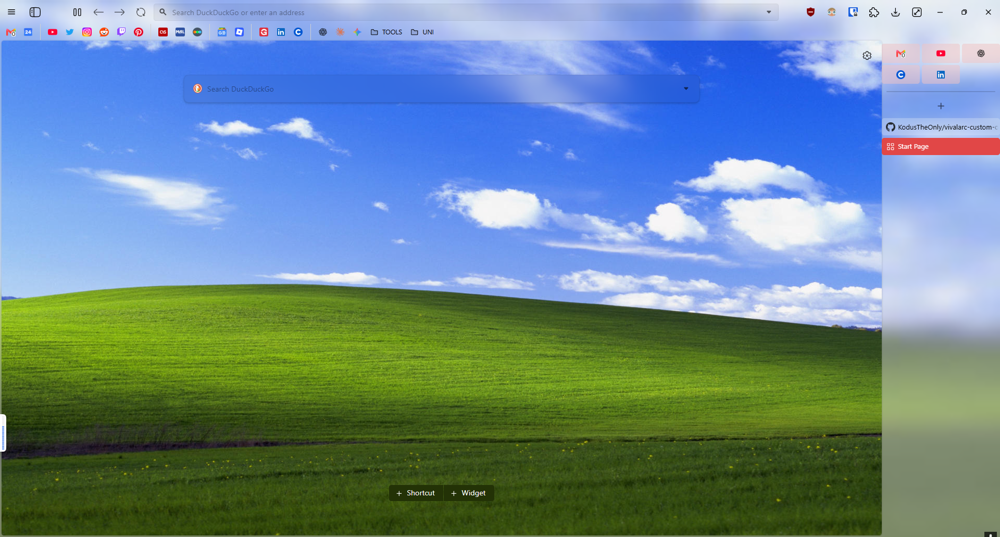

# vivalarc-custom-overrides

A collection of custom CSS overrides i made for [VivalArc](https://github.com/tovifun/VivalArc) on Vivaldi.

i built these tweaks around [ragnarokxg/VivalArc](https://github.com/ragnarokxg/VivalArc), a fork of the original VivalArc project with additional work focused on compatibility with Vivaldi 8.0+.

This repository only contains my own overrides. It does not redistribute the original VivalArc files.

## Preview


## Why i made this

Before moving to Vivaldi, i used **Zen Browser** and really liked the way it handled vertical tabs, pinned tabs, compact navigation, and screen space in general.

When i started using Vivaldi, i wanted to get as close as possible to that kind of workflow without giving up Vivaldi's customization options.

[VivalArc](https://github.com/tovifun/VivalArc) was already a really good starting point for that.

i ended up using [ragnarokxg/VivalArc](https://github.com/ragnarokxg/VivalArc) as my base because it had more recent changes aimed at **Vivaldi 8.0+**, which made it a better fit for the version of Vivaldi i was using.

From there, i started changing things to better fit the way i like to use my browser.

Some of the tweaks were just personal preferences, while others came from problems i ran into while resizing the sidebar or changing the layout.

My goal isn't to replace VivalArc. i just wanted to keep my own overrides in one place and share the setup i ended up using.

## What i changed

### Responsive pinned tabs

i made the pinned-tab grid adapt to the width of the sidebar:

- 3 columns when the sidebar is wide
- 2 columns at medium widths
- 1 column when the sidebar is very narrow

This prevents the pinned tabs from overlapping when i shrink the sidebar.

### Compact normal tabs

When the sidebar gets narrow enough, i switch normal tabs into a more compact layout:

- Tab titles are hidden
- Close buttons are hidden
- Favicons stay centered
- Tabs stay inside the available sidebar space

### Better tab scrolling

i ran into an issue where Vivaldi's tab container would start scrolling even though there was still unused vertical space below it.

Vivaldi was dynamically adding a `max-height` to the internal tab container, so i override that and let the tab list use the available space first.

### New Tab button placement

i moved the New Tab (`+`) button so it sits below the pinned tabs and above the normal tab list.

i also added a fallback position in case the separator i use as an anchor isn't available.

### Bookmark Bar only on the Start Page

i like having the Bookmark Bar on Vivaldi's Start Page, but i don't want it taking up space while i'm browsing normally.

The override hides it on regular pages and shows it when the active page is the Start Page.

### Removing extra webpage margins

i also removed the extra left and bottom margins around the webpage area so websites can use more of the available window.

### Accordion Tab Stack support

i fixed the Accordion Tab Stack toggle so it works correctly with the custom pinned-tab grid.

The toggle arrow stays aligned in both expanded and collapsed states without creating the spacing issues caused by VivalArc's global tab positioning rules.
## Requirements

You'll need:

- Vivaldi
- VivalArc or a compatible VivalArc fork
- Custom UI Modifications enabled in Vivaldi

i developed and tested these overrides mainly with:

- [ragnarokxg/VivalArc](https://github.com/ragnarokxg/VivalArc)
- VivalArc 1.4.x-style UI
- Vivaldi 8.0+

Since this CSS depends on Vivaldi's internal UI, future Vivaldi updates can break individual parts of it.

## Installation

### 1. Install VivalArc

Install VivalArc first.

Original project:

https://github.com/tovifun/VivalArc

The fork i use:

https://github.com/ragnarokxg/VivalArc

Follow the setup instructions from whichever version you decide to use.

If you want the same base i developed these overrides on, use the `ragnarokxg/VivalArc` fork.

### 2. Enable Custom UI Modifications

Open:

```text
vivaldi://experiments
```

Enable:

```text
Allow CSS modifications
```

Then go to:

```text
Settings → Appearance → Custom UI Modifications
```

and select the folder where your VivalArc CSS is stored.

### 3. Add the override file

Put:

```text
zz-custom.css
```

in the same folder as your VivalArc CSS.

For example:

```text
Vivaldi Custom CSS/
├── vivalarc.css
└── zz-custom.css
```

i use the `zz-` prefix so the override file loads after the main VivalArc stylesheet.

### 4. Restart Vivaldi

Restart Vivaldi after adding or updating the CSS.

## Project structure

```text
vivalarc-custom-overrides/
├── README.md
├── CHANGELOG.md
└── zz-custom.css
```

## How i worked on it

Most of this was made through a lot of manual testing with Vivaldi's UI DevTools.

i inspected the DOM, changed CSS rules, resized the sidebar, reproduced bugs, and tested the results directly in Vivaldi.

i also used **OpenAI Codex and ChatGPT** to help me with some of the more annoying debugging work, especially when i needed to inspect Vivaldi's internal UI structure, understand why a CSS rule wasn't behaving as expected, or verify a bug before changing anything.

i still tested the final behavior manually before keeping any of the changes.

## Compatibility

This CSS relies on Vivaldi's internal UI instead of a stable public extension API.

Some of the selectors i use include:

```css
#tabs-container
#webpage-stack
.toolbar-tabbar-after
.tab-strip
.webpageview
```

Vivaldi can change these in future updates, so i expect that some parts of the CSS may need adjustments over time.

## Credits

[VivalArc](https://github.com/tovifun/VivalArc) was created by **ToviFun** and is the base this project builds on.

i use [ragnarokxg/VivalArc](https://github.com/ragnarokxg/VivalArc) as my base because of its additional compatibility work for newer versions of Vivaldi.

The overall layout and workflow i was trying to recreate were heavily inspired by my previous setup in **Zen Browser**, especially its vertical tabs, pinned-tab layout, compact navigation, and use of screen space.

i also used **OpenAI Codex and ChatGPT** as tools while debugging and testing some of the more complex changes.

## Disclaimer

This is just my personal Vivaldi customization that i decided to put on GitHub in case it's useful to someone else.

i'm not affiliated with Vivaldi, VivalArc, Zen Browser, ToviFun, or ragnarokxg.

All i'm publishing here is my own CSS override file. The original VivalArc files belong to their respective project.
